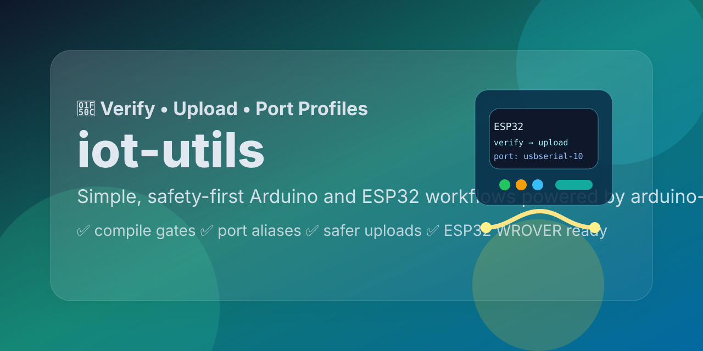

# iot-utils 🔌⚙️



[](LICENSE)
[](https://arduino.github.io/arduino-cli/)
[](https://espressif.github.io/arduino-esp32/package_esp32_index.json)
[](packaging/homebrew/iot-utils.rb.template)
[](https://buy.stripe.com/8x200i8bSgVe3Vl3g8bfO00)

Simple, safety-first helpers for verifying and uploading Arduino and ESP32 sketches with `arduino-cli`.

Support this project and related open learning/build tools: [Stripe support link](https://buy.stripe.com/8x200i8bSgVe3Vl3g8bfO00)

## Why this exists 🚀

`iot-utils` makes the common microcontroller workflow simpler and safer:

- ✅ `verify` checks the sketch before upload
- ✅ `upload` always includes verify first
- ✅ if no sketch is passed, it uses the latest changed `.ino` in the current working directory
- ✅ each run writes a latest log file beside the target sketch
- ✅ `port list` shows connected serial ports with board hints
- ✅ YAML aliases let `esp32` mean `esp32:esp32:esp32wrover`
- ✅ saved port aliases reduce repeated typing
- ✅ global default port avoids per-project confusion
- ✅ project-local override is available when needed
- ✅ upload fails closed when target detection is ambiguous

## Quick Start ⏱️

```bash
iot-utils --version
iot-utils config init --global
iot-utils port list
iot-utils port set /dev/cu.usbserial-10 --alias esp32-main
iot-utils verify --fqbn esp32
iot-utils upload --fqbn esp32
iot-utils upload path/to/blink.ino --fqbn esp32 --upload-speed 115200
iot-utils verify path/to/blink.ino --fqbn esp32
iot-utils upload path/to/blink.ino --fqbn esp32
```

## Install via Homebrew 🍺

```bash
brew tap dmoliveira/tap
brew install iot-utils
iot-utils --version
```

## Install from source 🧰

Install so `iot-utils` works from any folder:

```bash
./scripts/install.sh
```

This installs the executable into `~/.local/share/iot-utils` and links `~/.local/bin/iot-utils`.

If needed, add this to your shell profile:

```bash
export PATH="$HOME/.local/bin:$PATH"
```

## Commands 🧾

### Sketch workflows

```bash
iot-utils --version
iot-utils verify --fqbn esp32
iot-utils upload --fqbn esp32
iot-utils verify path/to/sketch.ino --fqbn esp32
iot-utils upload path/to/sketch.ino --fqbn esp32
iot-utils upload path/to/sketch.ino --fqbn esp32 --upload-speed 115200
iot-utils verify path/to/sketch.ino --fqbn uno
```

If you omit the sketch path, `iot-utils` scans the top-level `.ino` files in the current working directory and picks the most recently modified one.

### Port management

```bash
iot-utils port list
iot-utils port show
iot-utils port set /dev/cu.usbserial-10 --alias esp32-main
iot-utils port set /dev/cu.usbmodem1234 --alias uno-desk --project
iot-utils port clear --global
iot-utils port clear --alias esp32-main --global
```

### Config management

```bash
iot-utils config init --global
iot-utils config init --project
```

## YAML config aliases ✨

`iot-utils` supports simple YAML config for global and project settings.

Global config:

- `~/.config/iot-utils/config.yml`

Project config:

- `./.iot-utils.yml`

Example:

```yaml
default_fqbn: esp32
default_upload_speed: 115200
default_port: /dev/cu.usbserial-10
fqbn_aliases:
  esp32: esp32:esp32:esp32wrover
  uno: arduino:avr:uno
  nano: arduino:avr:nano
port_aliases:
  esp32-main: /dev/cu.usbserial-10
  uno-desk: /dev/cu.usbmodem1234
```

This means you can run:

```bash
iot-utils upload blink.ino --fqbn esp32
iot-utils upload blink.ino --port esp32-main --fqbn esp32
iot-utils upload blink.ino --fqbn esp32 --upload-speed 115200
```

## Parameter summary on start 🧭

At the start of `verify` and `upload`, `iot-utils` now shows the resolved:

- sketch file
- sketch directory
- FQBN and alias/input used
- port and alias/input used
- upload speed
- build path
- project/global config paths

That makes it easier to confirm exactly what is about to happen before compile or upload begins.

The terminal output is grouped into timestamped semantic sections such as:

- verify workflow / upload workflow
- sketch preparation
- target resolution
- safety checks
- compile
- upload
- run completed

At the end of the run, `iot-utils` also shows the total elapsed time.

## Latest run log 📝

Each `verify` or `upload` writes a latest-run log beside the sketch file:

```bash
path/to/Blink/Blink.iot-utils.log
```

Running again replaces that log so you always keep the latest result for that sketch.

## Port strategy 🔌

Port selection priority:

1. `--port`
2. project-local saved port in `.iot-utils.yml`
3. global saved port in `~/.config/iot-utils/config.yml`
4. auto-detected single usable port

If a saved port disappears but one close match is found, `upload` can ask once before using and updating the saved default.
If multiple ports exist but exactly one matches the selected/default board metadata, `iot-utils` now prefers that identified port automatically.
If a safely selected port does not report board metadata, `iot-utils` can fall back to your configured `default_fqbn` so you do not need `--fqbn` every time.

## Defaults ⚙️

Tracked repo defaults live in `iot-utils.json`:

- default board alias: `esp32`
- `esp32` → `esp32:esp32:esp32wrover`
- `uno` → `arduino:avr:uno`
- `nano` → `arduino:avr:nano`
- `mega` → `arduino:avr:mega`
- default upload speed: `115200`
- max flash usage: `95%`
- max RAM usage: `85%`
- fail closed if flash or RAM percentages are unavailable
- risky-pattern checks for infinite loops and ESP32 strap-pin mistakes

## Safety model 🛡️

`upload` always runs `verify` first and stops if any check fails.

Checks shown in the terminal:

- ✅ tool presence
- ✅ sketch path validation
- ✅ sketch staging/preparation
- ✅ board core availability
- ✅ board/FQBN resolution
- ✅ saved/default port resolution during upload
- ✅ risky code pattern scan
- ✅ compile success
- ✅ flash and RAM thresholds
- ✅ upload success

Fail-closed rules:

- ❌ no usable serial port
- ❌ multiple usable ports without explicit choice
- ❌ selected upload port with unknown board type when neither `--fqbn` nor `default_fqbn` is available
- ❌ compile failure
- ❌ flash or RAM usage missing when enforcement is required
- ❌ flash/RAM usage beyond configured limits

## Scripts for install and testing 🧪

- `scripts/install.sh` installs `iot-utils` for use from any folder
- `scripts/test-all.sh` runs a smoke-test pass across help, config, port, verify, and safe upload-failure paths

Run tests with:

```bash
./scripts/test-all.sh
```

## Homebrew / tap 🍺

Published formula:

```bash
brew tap dmoliveira/tap
brew install iot-utils
```

Formula source lives in your tap repo and this repo keeps a template at:

```bash
packaging/homebrew/iot-utils.rb.template
```

Recommended next release update flow:

1. bump `VERSION` in `iot-utils`
2. commit and push this repo
3. tag a new release
4. update the formula URL + SHA256 to the tagged tarball
5. sync the formula into `homebrew-tap`

Current install:

```bash
brew tap dmoliveira/tap
brew install iot-utils
```

## Installed locally for this repo 📦

- `arduino-cli`
- Espressif ESP32 index: `https://espressif.github.io/arduino-esp32/package_esp32_index.json`
- ESP32 core: `esp32:esp32`
- Arduino AVR core: `arduino:avr`

## Support This Project 💛

If this tool saves you time, helps you avoid bad uploads, or supports your hobby/prototyping workflow, you can help support maintenance and future open tooling work:

- Donate via Stripe: [Support this project](https://buy.stripe.com/8x200i8bSgVe3Vl3g8bfO00)
- Core usage remains free
- Support helps fund maintenance, polish, and new utilities

## License 📄

Apache-2.0. See `LICENSE`.
